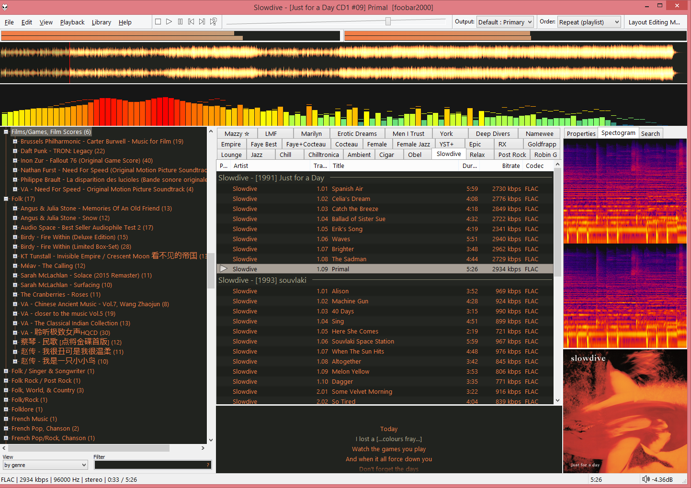
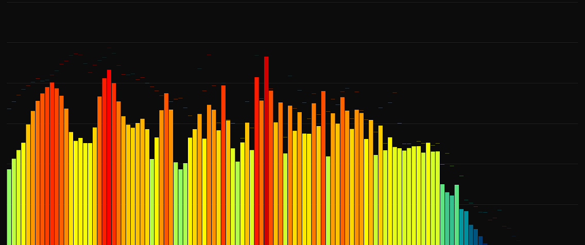

# My foobar2000 configuration

This is my configuration for foobar2000. The look and feel is configured to resemble WinAmp that I still love to this day.

## The theme

I have been a long time user of WinAmp in the 90s when MP3 files became very popular. When I transit over to listening to lossless music on PC and on proper sound setup, WinAmp became less relevant for me. Foobar2000 did not become the WinAmp replacement in the beginning because it lacked the WinAmp feel to it. After tweaking it for some time, I retired WinAmp and switch to Foobar2000.

The theme: [theme.fth](theme.fth)

## Spectrum configuration

The spectrum configuration that looked like the default WinAmp skin can be found here:

* [Attached window](Spectrum-Attached.cfg)
* [Full screen](Spectrum-FullScreen.cfg)
